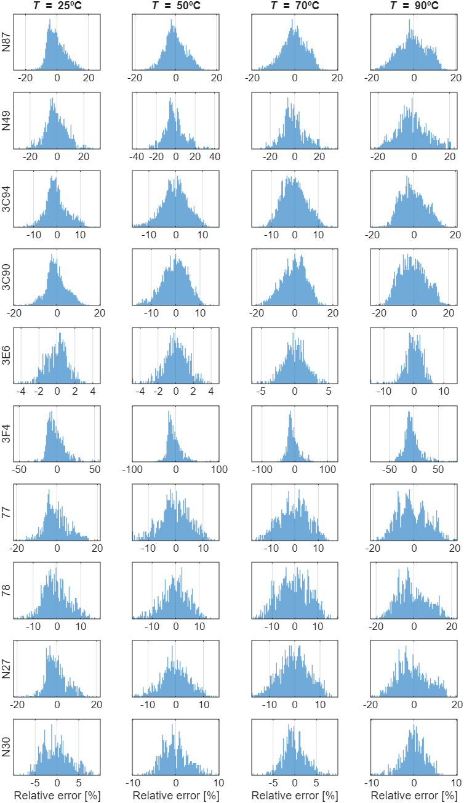

# Core-Loss-Model
This repository recolects informations, resources and advancements regarding core loss modelling.

## Composite Improved Generalised Steinmetz Equation

### Description of the ciGSE

The Composite Improved Generalised Steinmetz Equation (ciGSE) is the main core loss model developed by Mondragon University. As the name suggest, the model combines two previous works:

1. The Composite Waveform Hypothesis (CWH) |CWH|: main working principle for the model, responsible for the improved accuracy under different waveforms.
2. The Improved Generalised Steinmetz Equation (iGSE) |iGSE|: main mathematical foundation for the model, relating the model with other works from the Steinmetz Equation family of models.

According to the CWH, the per cycle energy losses $E$ in a magnetization waveform is the summation of the energy loss contributions $E_{i}$ of its different segments

$$E=\sum_{i}E_{i}$$

or rewritten for power losses $P_{i}$ instead of energy

$$P=\sum_{i}D_{i}·P_{i}$$

where $D_{i}$ are the duration factors of the different segments, thus $\sum_{i}[D_{i}]=1$. The CWH was demonstrated to be accurate along a wide data range |ciGSE_poly|, so the key to generate an accurate an usable model is to define the power loss function for $P_{i}$. Initially high order polynomials |ciGSE_poly| where proposed, but this results in a high number of parameters required and high error when extrapolation is used.

During the MagNet Challenge 2023 |MagNet_Challenge1| a dual-plane approach that closer resembles the iGSE |ciGSE_MagNet| was proposed.

$$\ln(P_{1})=k_1+{a_1}·\ln{\left|\frac{\Delta B}{\Delta t}\right|}+{b_1}·\ln(B_{pp})$$

$$\ln(P_{2})=k_2+{a_2}·\ln{\left|\frac{\Delta B}{\Delta t}\right|}+{b_2}·\ln(B_{pp})$$

$$P=P_{1}+P_{2}=\exp(k_1)·{\left|\frac{\Delta B}{\Delta t}\right|}^{a_1}·B_{pp}^{b_1}+\exp(k_2)·{\left|\frac{\Delta B}{\Delta t}\right|}^{a_2}·B_{pp}^{b_2}$$

The factors $k_1$, $a_1$, $b_1$, $k_2$, $a_2$, and $b_2$ are parametrized from datasets available at the MagNet database. Due to its similarity with the iGSE, which also models losses as functions of $|\Delta B/\Delta t|$ and $B_{pp}$, these parameters can be related with the iGSE Steinmetz parameters

$a = \alpha$, $b = \beta-\alpha$, $\exp(k)=k_{i}$

When evaluating the results, some correlation between the different materials are found out for these parameters

$\alpha_1 \approx 1$, $\alpha_2 \approx 2$, $\beta_2 \approx 2$

These values demonstrate a direct correlation with the dual plane approach and the hysteresis/eddy loss separation proposed by Charles Proteus Steinmetz on 1984, where the losses should take the form

$$P=\eta_{hyst}·f^1·B^{\beta}+\eta_{eddy}·f^2·B^2$$

Due to this, the dual plane approach is redefined, so that the power losses of each segment are the contribution of two different sources,

1. The quasi-static losses dominant at low frequencies, analogue to Steinmetz's hysteresis losses. $P_1=\exp(k_1)·{\left|\frac{\Delta B}{\Delta t}\right|}^{a_1}·B_{pp}^{b_1}$ → $P_{qs}=\exp(k_{qs})·{\left|\frac{\Delta B}{\Delta t}\right|}^{a_{qs}}·B_{pp}^{b_{qs}}$
2. The magnetization-rate losses dominant at high frequencies, analogue to Steinmetz's eddy losses. $P_2=\exp(k_2)·{\left|\frac{\Delta B}{\Delta t}\right|}^{a_2}·B_{pp}^{b_2}$ → $P_{mr}=\exp(k_{mr})·{\left|\frac{\Delta B}{\Delta t}\right|}^{a_{mr}}·B_{pp}^{b_{mr}}$

The complete ciGSE equation is thus:

$$P=\sum_{i}D_{i}·[\exp(k_{qs})·{\left|\frac{\Delta B}{\Delta t}\right|}^{a_{qs}}·B_{pp}^{b_{qs}}+\exp(k_{mr})·{\left|\frac{\Delta B}{\Delta t}\right|}^{a_{mr}}·B_{pp}^{b_{mr}}]$$

### Accuracy of the model
#### Triangular waveforms
The relative error distributions for the different materials at different temperatures are as following:

| Material | Temperature [ºC] | $E_{RMS}$ [%] | $E_{P5}$ [%] | $E_{P95}$ [%] | $E_{worst}$ [%] |
| :------- | :--------------- | :------------ | :----------- | :------------ | :-------------- |
| N87      | 25               | 6.06          | -8.24        | +10.9         | -27.6           |
| N87      | 50               | 5.40          | -7.74        | +8.07         | -21.3           |
| N87      | 70               | 5.78          | -10.3        | +8.77         | -20.2           |
| N87      | 90               | 6.93          | -11.9        | +10.5         | -20.6           |
| N49      | 25               | 8.16          | -13.6        | +12.5         | +32.2           |
| N49      | 50               | 10.7          | -17.7        | +18.0         | +44.6           |
| N49      | 70               | 9.65          | -16.1        | +16.9         | +35.1           |
| N49      | 90               | 8.57          | -15.0        | +14.8         | -24.2           |
| 3C94     | 25               | 4.89          | -7.58        | +8.97         | +18.6           |
| 3C94     | 50               | 5.04          | -8.96        | +7.99         | +16.2           |
| 3C94     | 70               | 5.24          | -8.26        | +8.88         | +18.4           |
| 3C94     | 90               | 6.15          | -9.45        | +10.2         | +20.8           |
| 3C90     | 25               | 5.00          | -8.45        | +8.51         | +20.2           |
| 3C90     | 50               | 5.29          | -9.24        | +8.11         | -17.9           |
| 3C90     | 70               | 6.56          | -11.9        | +9.67         | -22.7           |
| 3C90     | 90               | 7.78          | -12.4        | +12.6         | -25.1           |
| 3E6      | 25               | 1.23          | -2.07        | +1.93         | -4.83           |
| 3E6      | 50               | 1.34          | -2.22        | +2.24         | -4.89           |
| 3E6      | 70               | 1.73          | -2.80        | +2.81         | -6.40           |
| 3E6      | 90               | 2.94          | -4.89        | +4.22         | -14.5           |
| 3F4      | 25               | 12.1          | -15.0        | +20.9         | +57.7           |
| 3F4      | 50               | 17.7          | -22.6        | +29.3         | +101            |
| 3F4      | 70               | 21.1          | -29.4        | +32.8         | +131            |
| 3F4      | 90               | 18.1          | -27.8        | +28.3         | +88.3           |
| 77       | 25               | 6.12          | -9.32        | +10.8         | -21.4           |
| 77       | 50               | 5.58          | -9.94        | +9.04         | -15.9           |
| 77       | 70               | 6.23          | -10.7        | +9.69         | -18.3           |
| 77       | 90               | 7.51          | -11.7        | +12.0         | +21.3           |
| 78       | 25               | 5.54          | -8.57        | +9.52         | +18.2           |
| 78       | 50               | 5.81          | -10.6        | +8.77         | -18.4           |
| 78       | 70               | 6.88          | -11.4        | +10.5         | +19.1           |
| 78       | 90               | 8.11          | -12.6        | +13.5         | +23.0           |
| N27      | 25               | 5.50          | -7.95        | +10.0         | -21.8           |
| N27      | 50               | 5.20          | -9.42        | +8.48         | -15.7           |
| N27      | 70               | 6.03          | -10.5        | +9.75         | -17.1           |
| N27      | 90               | 7.36          | -11.7        | +12.7         | +20.1           |
| N30      | 25               | 3.22          | -4.73        | +5.74         | -9.96           |
| N30      | 50               | 3.09          | -4.58        | +5.29         | +10.1           |
| N30      | 70               | 2.74          | -4.23        | +4.51         | -9.97           |
| N30      | 90               | 2.75          | -4.75        | +4.32         | -10.2           |

### ciGSE parameters obtained from the MagNet database
The parameters fitted from the MagNet database are classified per tempaerature and DC bias. 
| Material | Temperature [ºC] | $k_{qs,1}$  | $a_{qs,1}$  | $b_{qs,1}$  | $k_{qs,2}$  | $a_{qs,2}$  | $b_{qs,2}$   |
| :------- | :--------------- | :---------- | :---------- | :---------- | :---------- | :---------- | :----------- |
| N87      | 25               |  5.4672e+00 |  8.2368e-01 |  1.6226e+00 | -1.5696e+01 |  2.4333e+00 |  2.5249e-02 |
| N87      | 50               |  2.8063e+00 |  1.0411e+00 |  1.6025e+00 | -1.7323e+01 |  2.5099e+00 | -2.4920e-01 |
| N87      | 70               |  1.6620e+00 |  1.1377e+00 |  1.7312e+00 | -1.6902e+01 |  2.4634e+00 | -3.0029e-01 |
| N87      | 90               |  4.4927e-01 |  1.2472e+00 |  1.8876e+00 | -1.6284e+01 |  2.4133e+00 | -3.2296e-01 |
| N49      | 25               |  2.6408e+00 |  1.1209e+00 |  2.0333e+00 | -2.3815e+01 |  2.8417e+00 | -5.8677e-01 |
| N49      | 50               |  1.9322e+00 |  1.1897e+00 |  2.1696e+00 | -2.5376e+01 |  2.9400e+00 | -7.4684e-01 |
| N49      | 70               |  1.8411e+00 |  1.2054e+00 |  2.1254e+00 | -2.4832e+01 |  2.9072e+00 | -7.3365e-01 |
| N49      | 90               |  2.1401e+00 |  1.1879e+00 |  2.0091e+00 | -2.3619e+01 |  2.8471e+00 | -6.1858e-01 |
| 3C94     | 25               |  2.5831e+00 |  1.0273e+00 |  1.4527e+00 | -1.6100e+01 |  2.4004e+00 | -1.3289e-01 |
| 3C94     | 50               |  9.3040e-01 |  1.1520e+00 |  1.6510e+00 | -1.5256e+01 |  2.3203e+00 | -1.9479e-01 |
| 3C94     | 70               | -2.7126e-01 |  1.2543e+00 |  1.9247e+00 | -1.4466e+01 |  2.2540e+00 | -1.8757e-01 |
| 3C94     | 90               | -1.7937e+00 |  1.3946e+00 |  2.1164e+00 | -1.4488e+01 |  2.2492e+00 | -2.1458e-01 |
| 3C90     | 25               |  3.5829e+00 |  9.7068e-01 |  1.5885e+00 | -1.7503e+01 |  2.5039e+00 | -1.7978e-01 |
| 3C90     | 50               |  2.1718e+00 |  1.0836e+00 |  1.7513e+00 | -1.7373e+01 |  2.4717e+00 | -3.1327e-01 |
| 3C90     | 70               |  1.4292e+00 |  1.1529e+00 |  1.9996e+00 | -1.6891e+01 |  2.4300e+00 | -3.2626e-01 |
| 3C90     | 90               |  4.1585e-01 |  1.2518e+00 |  2.1776e+00 | -1.6600e+01 |  2.4065e+00 | -3.3063e-01 |
| 3E6      | 25               | -8.1900e-01 |  1.2501e+00 |  1.2979e+00 | -1.1595e+01 |  2.0685e+00 | -1.0863e-01 |
| 3E6      | 50               |  6.2359e-01 |  1.1372e+00 |  1.2770e+00 | -9.9465e+00 |  1.9753e+00 | -5.3158e-03 |
| 3E6      | 70               |  1.0936e+00 |  1.0976e+00 |  1.1555e+00 | -9.8039e+00 |  1.9699e+00 |  4.6897e-04 |
| 3E6      | 90               |  7.8466e-01 |  1.1402e+00 |  1.1501e+00 | -1.0405e+01 |  2.0108e+00 | -4.0858e-02 |
| 3F4      | 25               |  9.6018e+00 |  5.8558e-01 |  2.3175e+00 | -1.1430e+01 |  2.1980e+00 |  7.9804e-01 |
| 3F4      | 50               |  7.8051e+00 |  7.5451e-01 |  2.3613e+00 | -1.6110e+01 |  2.5164e+00 |  5.1120e-01 |
| 3F4      | 70               |  4.7710e+00 |  1.0227e+00 |  2.2430e+00 | -2.2131e+01 |  2.8831e+00 | -6.2668e-02 |
| 3F4      | 90               |  3.4968e+00 |  1.1334e+00 |  2.1378e+00 | -2.4104e+01 |  2.9507e+00 | -4.8118e-01 |
| 77       | 25               |  2.8486e+00 |  1.0172e+00 |  1.3878e+00 | -1.6631e+01 |  2.4598e+00 | -1.2096e-01 |
| 77       | 50               |  6.8858e-01 |  1.1863e+00 |  1.4265e+00 | -1.6716e+01 |  2.4375e+00 | -2.6189e-01 |
| 77       | 70               | -8.6258e-01 |  1.3137e+00 |  1.6881e+00 | -1.5871e+01 |  2.3665e+00 | -2.8022e-01 |
| 77       | 90               | -2.2018e+00 |  1.4354e+00 |  1.8114e+00 | -1.5581e+01 |  2.3408e+00 | -2.9879e-01 |
| 78       | 25               |  2.3704e+00 |  1.0613e+00 |  1.4403e+00 | -1.6974e+01 |  2.4761e+00 | -1.8216e-01 |
| 78       | 50               |  5.5941e-01 |  1.2044e+00 |  1.5814e+00 | -1.6413e+01 |  2.4144e+00 | -2.6290e-01 |
| 78       | 70               | -7.4437e-01 |  1.3178e+00 |  1.8360e+00 | -1.5847e+01 |  2.3674e+00 | -2.7367e-01 |
| 78       | 90               | -1.8342e+00 |  1.4165e+00 |  1.8690e+00 | -1.5723e+01 |  2.3542e+00 | -2.8873e-01 |
| N27      | 25               |  3.4772e+00 |  9.7991e-01 |  1.4272e+00 | -1.6051e+01 |  2.4237e+00 | -6.4313e-02 |
| N27      | 50               |  1.3609e+00 |  1.1478e+00 |  1.5213e+00 | -1.6150e+01 |  2.4004e+00 | -2.1671e-01 |
| N27      | 70               |  1.7500e-01 |  1.2480e+00 |  1.7255e+00 | -1.5484e+01 |  2.3415e+00 | -2.4191e-01 |
| N27      | 90               | -9.1734e-01 |  1.3500e+00 |  1.7862e+00 | -1.5542e+01 |  2.3386e+00 | -2.8333e-01 |
| N30      | 25               |  1.1671e+00 |  1.1857e+00 |  1.9665e+00 | -1.1208e+01 |  2.0560e+00 | -1.5301e-02 |
| N30      | 50               |  1.3344e+00 |  1.1707e+00 |  1.7904e+00 | -1.0587e+01 |  2.0225e+00 |  2.6378e-03 |
| N30      | 70               |  9.4146e-01 |  1.2023e+00 |  1.6952e+00 | -1.0081e+01 |  1.9892e+00 |  1.1520e-02 |
| N30      | 90               | -4.2534e-01 |  1.3244e+00 |  1.5620e+00 | -9.6077e+00 |  1.9513e+00 | -2.1737e-03 |

## Relaxation aware ciGSE

## DC magnetization aware ciGSE

Repositery with all relevant work regarding core loss modelling.

This repository is currently under work, and will be updated with:

a) all relevant information regarding the work published in APEC 2026 before the event, including  
   a.1) datasets used for the models  
   a.2) relevant results and model accuracies compared with original datasets  
   a.3) examples of application for different waveforms  
   a.4) shareable loss functions  

b) additional relevant information as the model is improved and updated

